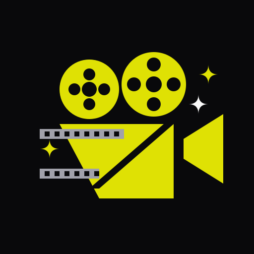

[![Contributors][contributors-shield]][contributors-url]
[![Forks][forks-shield]][forks-url]
[![Stargazers][stars-shield]][stars-url]
[![Issues][issues-shield]][issues-url]
[![MIT License][license-shield]][license-url]

<div align="center">
  <h1>AstroFilm</h1>
  <p>
    A high-performance cinematic web platform built with full-stack capabilities, 
    showcasing a bold, kinetic typography design system.
  </p>
  <p>
    
  </p>
  <p>
    <a href="#about-the-project">About</a> ·
    <a href="#getting-started">Getting Started</a> ·
    <a href="#architecture">Architecture</a> ·
    <a href="#contributing">Contributing</a> ·
    <a href="#license">License</a>
  </p>
</div>

## Table of Contents
- [About the Project](#about-the-project)
- [Features](#features)
- [Built With](#built-with)
- [Architecture](#architecture)
- [Getting Started](#getting-started)
- [Usage](#usage)
- [Roadmap](#roadmap)
- [Contributing](#contributing)
- [License](#license)
- [Contact](#contact)

## About The Project

**AstroFilm** is a modern, high-speed movie streaming interface. It leans heavily into a **High-energy Brutalism** and **Kinetic Typography** design philosophy. Expect sharp corners, high-contrast acid yellow (`#DFE104`) on rich black (`#09090B`), and fluid marquee animations instead of soft gradients and drop shadows.

The project is structured to deliver exceptional performance by leveraging Astro's partial hydration (Islands architecture) alongside a robust Shadcn UI component library customized for the strict design system. Video playback is handled seamlessly with robust fallback layers (HLS to iFrame Embeds) to guarantee an uninterrupted user journey.

## Features

- **Kinetic Design System**: Strict adherence to a brutalist, flat design language documented in `docs/design_system.md`.
- **Intelligent Video Playback**: Dynamic resolution switching with seamless fallback from native HLS to embedded iframes upon decoder failures.
- **Client-Side Routers**: Pre-fetching and aggressive image pre-warming on hover/focus for near-instant page transitions (`ClientRouter`).
- **SEO & Social Ready**: Engineered metadata wrappers for perfect sharing cards and discoverability.
- **Responsive Architecture**: Fluid layouts adapting perfectly from mobile screens to massive cinematic displays.

## Built With

- [Astro](https://astro.build)
- [React](https://react.dev)
- [Tailwind CSS](https://tailwindcss.com/)
- [Shadcn UI](https://ui.shadcn.com)
- [Vidstack Player](https://vidstack.io)
- [Framer Motion](https://www.framer.com/motion/)
- [Phosphor Icons](https://phosphoricons.com/)

## Architecture

- **Core Framework**: Astro drives the static generation and server-side rendering, ensuring zero-JS baselines where possible.
- **Interactive Islands**: React is used exclusively for highly interactive components (like the custom `VideoPlayer` and `GenreDialog`).
- **Styling Engine**: Tailwind CSS coupled with precise CSS variables mapping to the brutalist color scheme.
- **Media Layer**: Vidstack provides the core playback engine, tightly integrated with Framer Motion for gesture and UI controls.
- **Design Source of Truth**: `docs/design_system.md` dictates every CSS token, from border radiuses (always 0) to animated hover states (scale 1.05 and color inversion).

## Getting Started

### Prerequisites

- Node.js 18+
- npm, pnpm, or yarn

### Installation

1. Clone the repo:
   ```bash
   git clone https://github.com/TongDucThanhNam/astro-shadcn
   cd astro-shadcn
   ```
2. Install dependencies:
   ```bash
   npm install
   ```
3. Start the dev server:
   ```bash
   npm run dev
   ```

## Usage

- Navigate to `http://localhost:4321` (default Astro port).
- The homepage features the `HeroMovie` component and standard navigation.
- Use the Category dialog or direct links to explore the movie catalog.
- Open any movie page (`/phim/[slug]`) to experience the custom `VideoPlayer` with its intelligent fallback system and brutalist UI.

## Roadmap

- [x] Establish Kinetic Typography Design System
- [x] Implement robust HLS/Embed Video Player
- [x] Optimize ClientRouter with aggressive image pre-warming
- [x] Custom vector SGV Favicon
- [ ] Dedicated user profiles & watchlists
- [ ] Real-time commenting system
- [ ] Full backend API integration for dynamic catalog updates

## Contributing

1. Fork the repo.
2. Create your Feature Branch (`git checkout -b feature/AmazingFeature`).
3. Commit your Changes (`git commit -m 'Add some AmazingFeature'`).
4. **CRITICAL**: Ensure styles conform STRICTLY to `docs/design_system.md` (0px radius, flat design, no raw CSS shadows).
5. Push to the Branch (`git push origin feature/AmazingFeature`).
6. Open a Pull Request.

## License

MIT © AstroFilm / Tong Duc Thanh Nam

## Contact

- Maintainer: Terasumi · [LinkedIn](https://www.linkedin.com/in/tong-duc-thanh-nam)
- Project Link: [https://github.com/TongDucThanhNam/astro-shadcn](https://github.com/TongDucThanhNam/astro-shadcn)

[contributors-shield]: https://img.shields.io/github/contributors/TongDucThanhNam/astro-shadcn?style=for-the-badge
[contributors-url]: https://github.com/TongDucThanhNam/astro-shadcn/graphs/contributors
[forks-shield]: https://img.shields.io/github/forks/TongDucThanhNam/astro-shadcn?style=for-the-badge
[forks-url]: https://github.com/TongDucThanhNam/astro-shadcn/network/members
[stars-shield]: https://img.shields.io/github/stars/TongDucThanhNam/astro-shadcn?style=for-the-badge
[stars-url]: https://github.com/TongDucThanhNam/astro-shadcn/stargazers
[issues-shield]: https://img.shields.io/github/issues/TongDucThanhNam/astro-shadcn?style=for-the-badge
[issues-url]: https://github.com/TongDucThanhNam/astro-shadcn/issues
[license-shield]: https://img.shields.io/github/license/TongDucThanhNam/astro-shadcn?style=for-the-badge
[license-url]: https://github.com/TongDucThanhNam/astro-shadcn/blob/main/LICENSE
